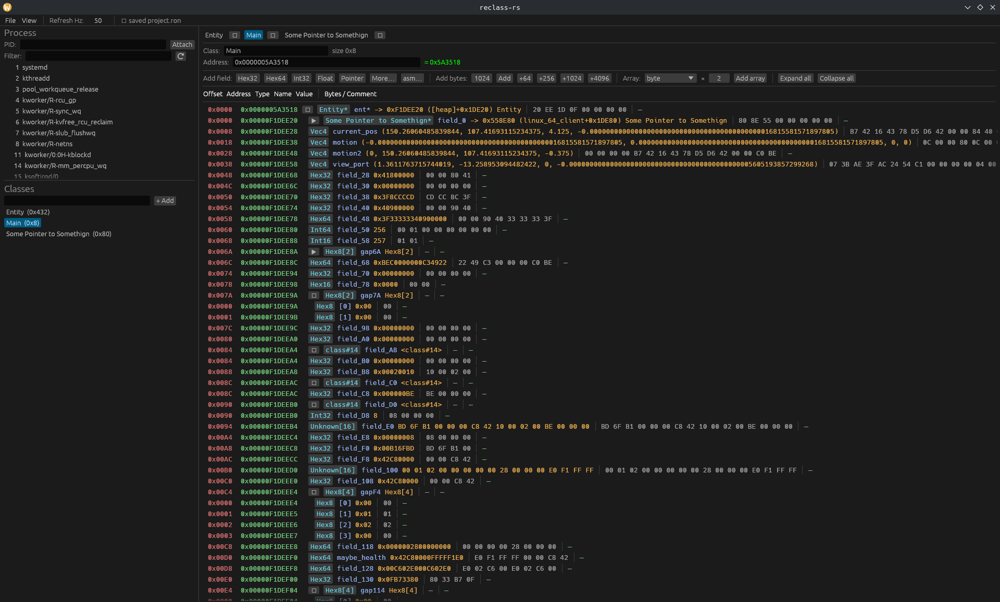
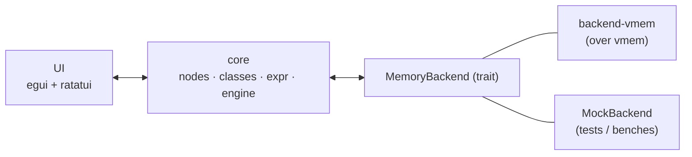

# reclass-rs
---


---
A native-Linux, [ReClass.NET](https://github.com/ReClassNET/ReClass.NET)-style **live memory inspector** for reconstructing the in-memory layout of a running process — written in Rust, with no Mono/WinForms.

You define a *class* as an ordered list of typed *fields*; reclass-rs resolves a base address, re-reads the target's memory a few times a second, and renders each field's **offset / address / type / name / value / raw bytes** with inline editing. Point it at a process, build up structs interactively, follow pointer chains, and export the result as C / C++ / Rust.

> ⚠️ **Linux / x86-64 only. Userspace only.** This is a research/RE tool. Only use it on processes you own or are authorized to inspect. See [Legal & ethics](#legal--ethics).

---

## Highlights

- **Live, batched reads.** The render loop gathers every visible address and issues **one** scatter read per pointer-chain level (`process_vm_readv`) — never one syscall per field. Partial reads are tolerated, so a class that overruns its mapping still shows the mapped prefix.
- **Full ReClass-style node set:** `Hex8/16/32/64`, signed/unsigned ints, `Float`, `Double`, `Bool`, `Vec2/3/4`, `Text`/`WText`, `Pointer`, `FunctionPtr`, `Array[N]`, inline `ClassInstance`, `ClassPtr`, `Padding`, `Unknown`, plus assembly size keywords (`byte/word/dword/qword/tword/oword/yword/zword`).
- **Derived offsets** that recompute and re-cache on every structural edit; inline `ClassInstance` cycles are detected and rejected (`ClassPtr` cycles are fine — they're a read boundary).
- **Address expressions:** `<module.so> + 0x10`, `[0xADDR]`, `[<module> + 0x10] + 0x20`, with `+ - * /`.
- **egui desktop UI** (default) and a **ratatui terminal UI** (`--tui`) over the same core:
  - colorized, monospace, virtualized table (smooth with thousands of fields) with horizontal scrolling;
  - **collapsible** arrays / class instances / pointers;
  - left-click a type to change it; right-click a row to rename / delete / insert / *add bytes to a pointer's target*;
  - multi-select rows (Click / Ctrl / Shift) + `Delete`; same for the class list;
  - bulk **Add bytes** and an **Array builder** (`element × count`);
  - **Expand all / Collapse all**, and a **View** menu to hide the Classes panel and focus on memory;
  - **value-change flash** that fades out so live changes are easy to spot;
  - inline editing of values, names, and comments with write-back to the target.
- **Process picker**, **memory-map view**, and **project save/load** (RON) that remembers the attached process name and **auto-attaches** on load.
- **Settings** window (*View → Settings*) persisted to `~/.config/reclass-rs/settings.ron`: value-change highlight color + fade + on/off, the default field type (e.g. `Hex64` → `Int64`) and seed-row count for new classes, the max array elements rendered, and the **MCP control server** toggle + port (see [MCP server](#mcp-server)).
- **Code generation** to C, C++, and Rust (`#[repr(C, packed)]`), with offsets as comments — generated Rust's `size_of`/`offset_of` match the model (verified by a test).
- **Optional ptrace access tracker** (`access-tracker` feature): "what instruction wrote/accessed this address" via x86-64 hardware breakpoints.
- **MCP control server** (loopback, off by default): an in-process [Model Context Protocol](https://modelcontextprotocol.io) endpoint that hands an AI agent full control — create classes, type fields, read/write memory, attach, run codegen. Built to pair with [IDA Pro MCP](https://github.com/mrexodia/ida-pro-mcp): the agent reads code in IDA and **builds the matching structs here, live**. See [MCP server](#mcp-server).

## Try it — the playground

A self-contained C target with a live-mutating `Player` struct (and a `Weapon` it points to) lives under [`examples/playground`](examples/playground/), with a full **[guided tour](examples/playground/README.md)**. Build it, attach, and rebuild the struct live — no game, no anti-cheat, default ptrace settings:


---

## Architecture

Everything is decoupled from the memory backend behind a trait, so the whole model and render loop are unit-testable with an in-memory fake — no live process required.



```rust
pub trait MemoryBackend {
    fn read(&self, addr: u64, buf: &mut [u8]) -> Result<(), MemError>;
    fn write(&self, addr: u64, data: &[u8]) -> Result<(), MemError>;
    fn read_scatter(&self, reqs: &mut [ScatterReq<'_>]) -> Result<(), MemError>;
    fn regions(&self) -> Result<Vec<Region>, MemError>;
    fn module_base(&self, name: &str) -> Option<u64>;
}
```

### Workspace layout

```
reclass-rs/
  crates/
    core/            # reclass-core — no UI, no vmem dep; nodes, classes, expr, engine, codegen, project
    backend-vmem/    # reclass-backend-vmem — MemoryBackend over the `vmem` crate (+ smoke CLI, access tracker)
    app/             # reclass — egui (default) + ratatui (--tui) front-ends
  docs/vmem-api.md   # vmem capability → API mapping
```

---

## Prerequisites

- **Rust** (stable, edition 2024) — `rustup` recommended.
- The [`vmem`](https://github.com/Jirubizu/vmem) crate checked out **as a sibling directory**:

  ```sh
  git clone https://github.com/Jirubizu/reclass-rs   # this repo
  ```

- **ptrace permission** to read another process. Easiest for development:

  ```sh
  sudo sysctl -w kernel.yama.ptrace_scope=0
  ```

  Or grant `cap_sys_ptrace`, run as root, or only attach to your own descendants. Cross-process I/O uses `process_vm_readv`/`writev`, so no `ptrace`-stop is required for plain reads/writes.

---

## Build & run

```sh
cd reclass-rs

# desktop (egui) UI — attach by pid and point at an address on launch
cargo run --release -p reclass -- --pid 1234 --addr 0x5A3518

# terminal (ratatui) UI
cargo run --release -p reclass -- --tui --pid 1234

# CLI flags
#   --pid <N>        attach to pid N
#   --addr <expr>    seed the starter class's address bar (e.g. 0x5A3518 or "[<game>+0x10]")
#   --project <ron>  load a saved project at launch (classes + expressions)
#   --tui            use the terminal front-end
```

### Throwaway smoke tool

A tiny CLI to sanity-check the backend against a process:

```sh
cargo run -p reclass-backend-vmem --bin smoke -- <pid> 0x5A3518 64   # hexdump 64 bytes
cargo run -p reclass-backend-vmem --bin smoke -- <pid> --maps        # list mapped regions
cargo run -p reclass-backend-vmem --bin smoke -- <pid> --modules libc.so.6
```

---

## Using the UI

1. **Attach** — type a PID and click *Attach*, or pick a process from the list (filter by name).
2. **Set an address** — type an expression in the address bar (see below). The `= 0x…` indicator turns **green** when it resolves into a readable region, **yellow** if unmapped, **red** on a parse/deref error.
3. **Build the class** — use *Add field* / *Add bytes* / the *Array* builder, or **left-click a field's Type** to change it. Memory shows live; **changed values flash red** and fade.
4. **Edit** — double-click a value/name/comment to edit it; value edits are written back to the target.
5. **Follow pointers** — expand a `Ptr`/`ClassPtr` (▶) to follow it; right-click a pointer → *Add bytes to target* to grow the pointed-to class without opening it.
6. **Save/Load** — *File → Save / Save as… / Open project…* open an in-app file browser (filters to `*.ron`); *File → Open recent* lists your last projects. Projects are RON; the attached process **name** is saved and reconnected automatically on load.
7. **Export** — *View → Code generation* dumps the registry as C / C++ / Rust.

### Address expression syntax

| Expression | Meaning |
|---|---|
| `0x5A3518` | absolute address |
| `<module.so> + 0x10` | module load base + offset |
| `[0xADDR]` | pointer-sized dereference |
| `[<module> + 0x10] + 0x20` | nested deref then offset |
| `+ - * /` | integer arithmetic |

> **PIE vs non-PIE:** for a position-independent binary, IDA addresses are RVAs → use `<module> + rva`. For a fixed-base (`ET_EXEC`) binary, IDA shows absolute addresses → use them directly (`[0x5A3518]`) or subtract the image base (`0x400000`) before adding the module base.

### Mouse & keys (table)

- **Click offset cell** — select row · **Ctrl-click** toggle · **Shift-click** range · **Delete** removes selected.
- **Left-click Type** — change type · **Right-click offset** — rename / insert / delete / add-bytes-to-target.
- **▶/▼** — expand/collapse arrays, class instances, and pointers.

---

## MCP server

reclass-rs can expose its live state to an AI agent over the [Model Context Protocol](https://modelcontextprotocol.io), so a tool like [IDA Pro MCP](https://github.com/mrexodia/ida-pro-mcp) can drive it: the agent reads code / xrefs / decompilation in IDA and **builds the matching structures here**, with fields and offsets appearing in the window as it works.

- **Transport:** JSON-RPC 2.0 over HTTP (POST; streamable-HTTP compatible), bound to **`127.0.0.1` only** — never exposed off-host.
- **Off by default.** Enable it in *View → Settings → **MCP control server***: tick **enabled** and pick a **port** (default `3900`). The server starts immediately; changing the port restarts it, unticking stops it. The choice persists to `settings.ron`, so it auto-starts next launch.
- Agent writes are applied on the UI thread, so you **watch the structs being built live** and can keep editing alongside it.

### Endpoint

```
http://127.0.0.1:<port>/     # default port 3900; POST JSON-RPC
```

Sanity-check it with curl (works with the server enabled, no attach needed):

```sh
curl -s http://127.0.0.1:3900/ \
  -H 'Content-Type: application/json' \
  -d '{"jsonrpc":"2.0","id":1,"method":"tools/list"}' | jq .result.tools[].name
```

### Connecting a client

Point any streamable-HTTP MCP client at the URL. For Claude Code:

```sh
claude mcp add --transport http reclass-rs http://127.0.0.1:3900/
```

Or as JSON in `.mcp.json` / `~/.claude.json` (alongside your IDA Pro MCP entry):

```json
{
  "mcpServers": {
    "reclass-rs": { "type": "http", "url": "http://127.0.0.1:3900/" },
    "ida-pro-mcp": { "type": "http", "url": "http://127.0.0.1:8744/sse" }
  }
}
```

With both connected, the agent can read a structure in IDA and reproduce it here: `create_class` → `add_node` per field → `set_address_expr`, then `get_rows` to read the live values back.

### Tools

| Area | Tools |
|---|---|
| Classes | `list_classes`, `get_class`, `create_class`, `remove_class`, `rename_class`, `set_address_expr` |
| Fields | `add_node`, `insert_node`, `remove_node`, `set_node_kind`, `set_node_name`, `set_node_comment`, `set_array_count`, `add_bytes` |
| Memory | `read_memory`, `write_memory`, `list_regions`, `get_rows` |
| Target | `list_processes`, `attach_pid` |
| Project | `codegen`, `save_project`, `load_project` |

A field type (`kind`) is a **shorthand string** — `u8`/`u16`/`u32`/`u64`, `i8`…`i64`, `f32`, `f64`, `bool`, `ptr`, `fnptr`, `hex8`…`hex64`, `vec2`/`vec3`/`vec4` — **or** a full NodeKind JSON object for complex types, e.g. `{"Array":{"element":{"Hex":"W64"},"count":8}}`, `{"ClassPtr":{"class_id":3}}`, `{"Text":{"encoding":"Utf8","len":32}}`. Addresses accept a number or a `0x…` string. Read-only resources mirror the read tools: `reclass://classes`, `reclass://regions`, `reclass://rows`, `reclass://codegen/rust`, `reclass://codegen/cpp`.

> ⚠️ The MCP tools **read and write arbitrary target memory** and can attach to processes. Keep the server on loopback, only enable it while an agent is driving reclass-rs, and treat any connected client as fully trusted.

---

## Feature flags

| Crate | Feature | Default | Purpose |
|---|---|---|---|
| `reclass-core` | `mock` | ✅ | in-memory `MockBackend` (tests, benches, offline) |
| `reclass-core` | `serde` | ✅ | RON project save/load |
| `reclass` (app) | `gui` | ✅ | egui desktop front-end |
| `reclass` (app) | `tui` | ✅ | ratatui terminal front-end |
| `reclass-backend-vmem` | `access-tracker` | ❌ | ptrace hardware-breakpoint access tracker (contains the only `unsafe`) |

```sh
cargo build -p reclass-backend-vmem --features access-tracker   # enable the access tracker
```

---

## Testing & benchmarks

```sh
cargo test --workspace --all-features      # full suite (incl. live read against a spawned child)
cargo bench -p reclass-core --bench engine # render-loop benchmarks (criterion)
```

The benches prove the engine batches reads — a flat 256-byte / 64-field class costs **one** scatter call per tick; a depth-4 pointer chain costs four (one per level). The live-memory tests spawn a helper child and self-skip if `ptrace` is denied.

---

## Conventions & quality bar

- Edition 2024, stable toolchain. `#![forbid(unsafe_code)]` in `core`; `unsafe` is confined to the `backend-vmem` access tracker, each call `// SAFETY`-noted.
- Errors: `thiserror` in libraries, `anyhow` only in the app.
- `cargo fmt --all --check` and `cargo clippy --all-targets --all-features -D warnings` are clean; every `core` module ships unit tests.
- CI (`.github/workflows/ci.yml`) runs fmt + clippy + test + bench-compile (and checks out `vmem` as a sibling).

---

## Legal & ethics

reclass-rs reads and **writes** another process's memory. Doing so can corrupt or crash the target. Only use it on software you own or have explicit permission to analyze, and respect the EULA/Terms of the programs you inspect. This project is for reverse-engineering, debugging, and education — not for cheating in online games or any unauthorized tampering. You are responsible for how you use it.

## License

MIT — see [`LICENSE`](LICENSE). The `vmem` dependency is dual-licensed MIT OR Apache-2.0.

## Acknowledgements

- UX inspired by [ReClass.NET](https://github.com/ReClassNET/ReClass.NET).
- Memory backend powered by [`vmem`](https://github.com/Jirubizu/vmem).
