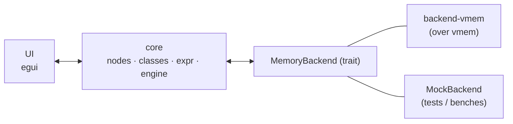

# Architecture

Everything is decoupled from the memory backend behind a trait, so the whole
model and render loop are unit-testable with an in-memory fake — no live process
required.



## The backend seam

```rust
pub trait MemoryBackend {
    fn read(&self, addr: u64, buf: &mut [u8]) -> Result<(), MemError>;
    fn write(&self, addr: u64, data: &[u8]) -> Result<(), MemError>;
    fn read_scatter(&self, reqs: &mut [ScatterReq<'_>]) -> Result<(), MemError>;
    fn regions(&self) -> Result<Vec<Region>, MemError>;
    fn module_base(&self, name: &str) -> Option<u64>;
}
```

`read_scatter` is the one that matters: the engine resolves every visible address
first, then issues **one** scatter call per pointer-chain level. A flat class of
64 fields costs one syscall per tick, a depth-4 chain costs four. The `engine`
benches assert exactly that, so a regression that reverts to per-field reads
fails CI rather than just feeling slow.

`MemoryBackend` has no `Send` bound — it is held as `Box<dyn MemoryBackend>` and
used only from the UI thread. Anything that needs memory off-thread (the pointer
scanner) re-attaches by pid instead of borrowing it.

Two implementations:

- [`reclass-backend-vmem`](../crates/backend-vmem/) — the real one, over
  [`vmem`](https://github.com/Jirubizu/vmem): `process_vm_readv`/`writev` by
  default, or `/dev/vmem` when the kernel backend is enabled in Settings. See
  [`vmem-api.md`](vmem-api.md) for the call-by-call mapping and its gotchas.
- `MockBackend` (`reclass-core`, `mock` feature) — a flat in-memory map used by
  every unit test and bench.

## Workspace layout

```
reclass-rs/
  crates/
    core/              # reclass-core — no UI, no vmem dep; nodes, classes, expr, engine, codegen, project
    backend-vmem/      # reclass-backend-vmem — MemoryBackend over the `vmem` crate (+ smoke CLI, access tracker)
    app/               # reclass — egui front-end, MCP server, plugin host
    official-plugins/  # reclass-official-plugins — the bundled plugins, one cdylib
    example-plugin/    # reclass-example-plugin — reference plugin, the API by example
  examples/playground/ # C target + guided tour
  docs/                # this documentation
```

### `reclass-core` modules

| Module | Responsibility |
|---|---|
| [`backend`](../crates/core/src/backend.rs) | `MemoryBackend`, `MemError`, `Region`, `ScatterReq`, `MockBackend` |
| [`node`](../crates/core/src/node.rs) | `NodeKind` — every field type, its size, formatting, and edit parsing |
| [`class`](../crates/core/src/class.rs) | `ClassRegistry`, derived offsets, cycle rejection, reference rewriting, `PtrWidth` |
| [`expr`](../crates/core/src/expr.rs) | address-expression parser and resolver |
| [`engine`](../crates/core/src/engine.rs) | the batched read loop; produces the `Row` list the UI renders |
| [`codegen`](../crates/core/src/codegen/) | C / C++ / Rust emission |
| [`project`](../crates/core/src/project.rs) | RON save/load |
| [`rcnet`](../crates/core/src/rcnet/) | ReClass.NET `.rcnet` import/export (feature-gated) |
| [`scan`](../crates/core/src/scan.rs) | pointer-chain scanner |

### `reclass` (app) modules

`app_state` is the egui-independent application core — attach, resolve
expressions, drive the engine, apply edits — and it is what the front-end, the
plugin host, and the MCP server mutate. Everything else is a view over it:
`gui/` (egui), `mcp` (JSON-RPC server), `plugin` (the `dlopen` host), `updater`
(self-update).

That single mutation path is why undo covers plugin and agent edits for free.

## Feature flags

| Crate | Feature | Default | Purpose |
|---|---|---|---|
| `reclass-core` | `mock` | ✅ | in-memory `MockBackend` (tests, benches, offline) |
| `reclass-core` | `serde` | ✅ | RON project save/load |
| `reclass-core` | `rcnet` | ❌ | ReClass.NET `.rcnet` import/export (pulls `flate2`); the app enables it |
| `reclass` (app) | `gui` | ✅ | egui desktop front-end |
| `reclass-backend-vmem` | `access-tracker` | ❌ | ptrace hardware-breakpoint access tracker |

```sh
cargo build -p reclass-backend-vmem --features access-tracker
```

## `unsafe`

`reclass-core` is `#![forbid(unsafe_code)]`. Elsewhere `unsafe` lives in exactly
three places, each `// SAFETY`-noted:

1. the `backend-vmem` access tracker (ptrace debug registers),
2. `select_backend` (one `set_var` before any thread starts),
3. the plugin loader (`dlopen` plus the C-ABI entry points) — see
   [the ABI contract](plugins.md#the-abi-contract).
