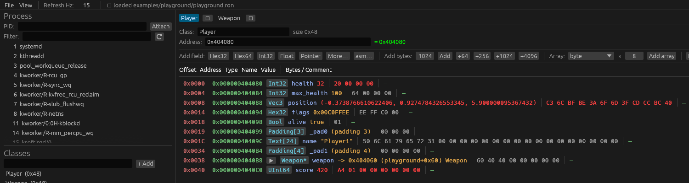

# Getting started

Linux host, x86-64, userspace only. 32-bit *targets* are supported (see
[User guide → 32-bit targets](user-guide.md#32-bit-targets)); the host build is
x86-64.

## Prerequisites

- **Rust** (stable, edition 2024) — `rustup` recommended.
- Nothing else to fetch by hand: [`vmem`](https://github.com/Jirubizu/vmem) is a
  pinned git dependency, so `cargo` resolves it for you.
- **ptrace permission** to read another process. Easiest for development:

  ```sh
  sudo sysctl -w kernel.yama.ptrace_scope=0
  ```

  Or grant `cap_sys_ptrace`, run as root, or only attach to your own
  descendants. Cross-process I/O uses `process_vm_readv`/`writev`, so no
  `ptrace`-stop is required for plain reads and writes.

## Install a release

Grab the latest [release](https://github.com/Jirubizu/reclass-rs/releases/latest):

```sh
tar xzf reclass-linux-x86_64.tar.gz
./reclass
```

The archive holds the `reclass` binary plus the bundled plugins in `plugins/`,
which the app picks up from next to the binary. Both halves are built by the
same toolchain in one CI step — the loader verifies that, see
[the same-toolchain contract](plugins.md#the-abi-contract) — so keep the pair
together, or drop the `.so` into `~/.config/reclass-rs/plugins` instead.

In-app updates (*View → Check for updates…*) do the same swap for you: they
compare this build against the newest GitHub release, show its changelog, and on
one button download the tarball and replace the binary plus its matching plugin
bundle. Takes effect on restart.

## Build from source

```sh
git clone https://github.com/Jirubizu/reclass-rs
cd reclass-rs && cargo build --release
```

## Run

```sh
# attach by pid and point at an address on launch
cargo run --release -p reclass -- --pid 1234 --addr 0x5A3518
```

| Flag | Meaning |
|---|---|
| `--pid <N>` | attach to pid N |
| `--addr <expr>` | seed the starter class's address bar (e.g. `0x5A3518` or `"[<game>+0x10]"`) |
| `--project <ron>` | load a saved project at launch (classes + expressions) |

## First session: the playground

Don't learn this against a real target. [`examples/playground`](../examples/playground/)
is a self-contained C program with a live-mutating `Player` struct (and a
`Weapon` it points to), plus a full **[guided tour](../examples/playground/README.md)**
that walks the whole workflow — build it, attach, rebuild the struct live. No
game, no anti-cheat, default ptrace settings.



## Throwaway smoke tool

A tiny CLI to sanity-check the backend against a process without the UI:

```sh
cargo run -p reclass-backend-vmem --bin smoke -- <pid> 0x5A3518 64   # hexdump 64 bytes
cargo run -p reclass-backend-vmem --bin smoke -- <pid> --maps        # list mapped regions
cargo run -p reclass-backend-vmem --bin smoke -- <pid> --modules libc.so.6
```

## Next

- [User guide](user-guide.md) — the UI, every node type, address expressions.
- [MCP server](mcp.md) — let an AI agent build the structs for you.
- [Plugin authoring](plugins.md) — extend the host.
