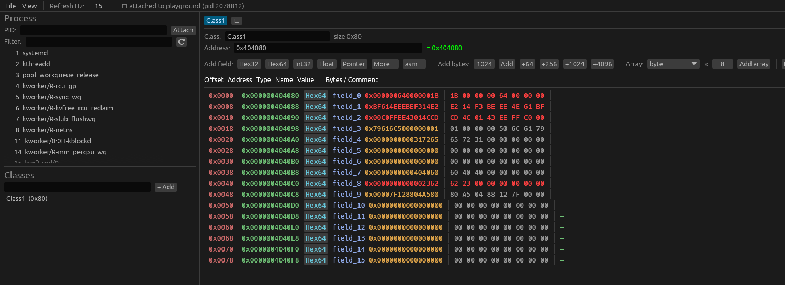
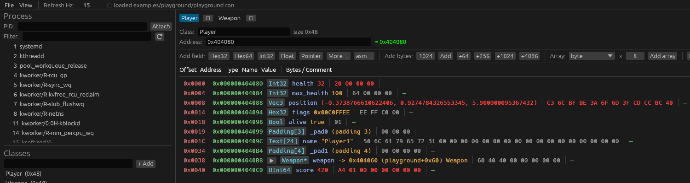
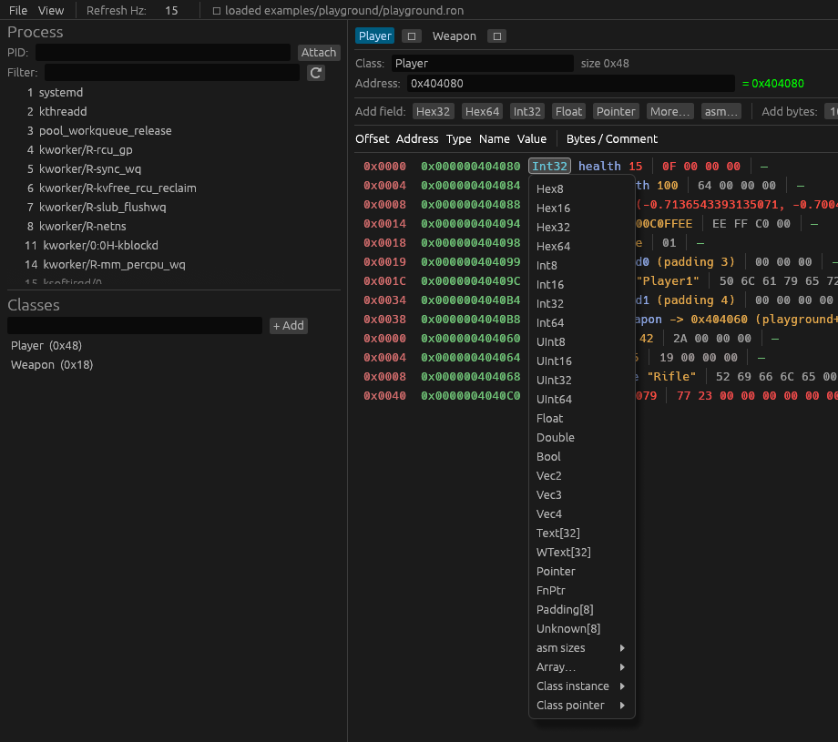
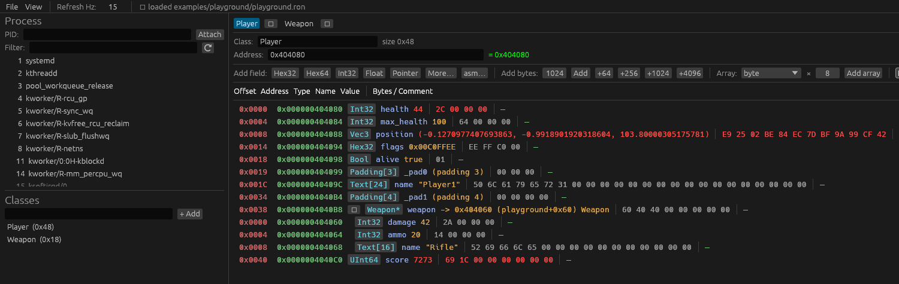
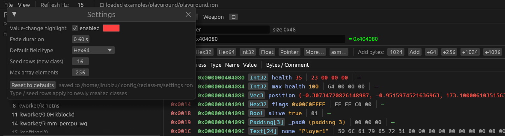
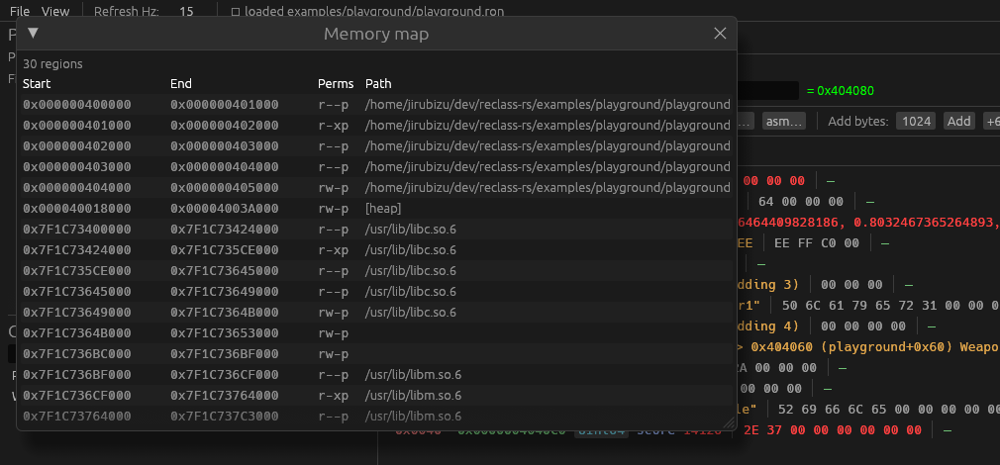

# reclass-rs playground — a guided tour

A tiny C program with a global `Player` struct (and a `Weapon` it points to)
whose fields change a few times a second. Attach **reclass-rs** to it and watch
memory update live while you rebuild the struct by hand — exactly the workflow
you'd use on a real target, but with a friendly, open-source binary you own.

> Everything here is local and same-user, so it works with default ptrace
> settings. No game, no anti-cheat, nothing to break.

---

## 1. Build & run the target

```sh
cd examples/playground
make
./playground
```

It prints a banner and then loops forever (~10 Hz), mutating the player:

```
playground pid=2078377
&g_player = 0x404080
&g_weapon = 0x404060
Player offsets: health=0x00 max_health=0x04 position=0x08 flags=0x14 alive=0x18 name=0x1c weapon=0x38 score=0x40 (sizeof=0x48)
Weapon offsets: damage=0x00 ammo=0x04 name=0x08 (sizeof=0x18)
```

The binary is built **non-PIE**, so `&g_player` is the *same address every run*
(`0x404080` here). Copy the `pid` and that address — you'll need both.

The C layout (see [`playground.c`](playground.c)):

| field        | C type        | offset | reclass type   |
|--------------|---------------|--------|----------------|
| `health`     | `int32_t`     | `0x00` | `Int32` (oscillates 0–100) |
| `max_health` | `int32_t`     | `0x04` | `Int32`        |
| `position`   | `float[3]`    | `0x08` | `Vec3` (moves) |
| `flags`      | `uint32_t`    | `0x14` | `Hex32` (`0x00C0FFEE`) |
| `alive`      | `int32_t`     | `0x18` | `Bool`         |
| `name`       | `char[24]`    | `0x1C` | `Text[24]` (`"Player1"`) |
| `weapon`     | `Weapon*`     | `0x38` | `ClassPtr → Weapon` |
| `score`      | `uint64_t`    | `0x40` | `UInt64` (counts up) |

---

## 2. Attach reclass-rs

From the repo root, with the playground still running:

```sh
# build the inspector once
cargo build --release -p reclass

# attach by pid and seed the address bar with &g_player from the banner
./target/release/reclass --pid <PID> --addr 0x404080
```

You land on a fresh `Class1` of `Hex64` rows reading live memory at `0x404080`.
Raw bytes, no interpretation yet — the **red** cells are values that changed
since the last frame (health, the position floats, the score):



> **Addresses.** `0x404080` is stable for *this* non-PIE build. If your rebuild
> differs, just read the address from the banner, or use the module-relative
> form `<playground> + 0x4080` (works regardless of where the loader puts it).
> For PIE targets the module-relative form is the way to go.

---

## 3. Skip ahead: load the finished layout

The repo ships the fully-typed project. Load it to see the end state in one shot
(`--project` loads it at launch; you can also use **File → Open project…**):

```sh
./target/release/reclass --pid <PID> --project examples/playground/playground.ron
```



Now every field is interpreted: `health` is an `Int32`, `position` is a live
`Vec3`, `flags` reads `0x00C0FFEE`, `alive` is a `Bool`, `name` is the string
`"Player1"`, `score` ticks up as a `UInt64`, and `weapon` is a pointer annotated
with its target and region: `0x404060 (playground+0x60) Weapon`.

---

## 4. Build it yourself (the real workflow)

You don't need the project file — building it live is the whole point. Starting
from the raw `Hex64` view:

### Change a field's type

**Left-click** any **Type** cell to open the type menu and pick what the bytes
really are (`Int32`, `Float`, `Vec3`, `Text`, a class pointer, an `asm` block
size, an `Array…`, …):



Set `0x00 → Int32` and name it `health` (double-click the **Name** cell). Take
damage in-game and watch it tick — that's how you confirm an offset is right.

### Follow the pointer

`weapon` holds an address. Click the **▶** on its row (or **Expand all**) to
follow it and render the `Weapon` inline — `damage`, `ammo`, and the `"Rifle"`
string read straight from `0x404060`:



The read is **batched**: the whole class is one scatter read per pointer level,
not one syscall per field.

### Watch values change

As the game runs, cells that changed since the last frame flash and fade out.
The colour, fade time, and on/off toggle live in **Settings** (next section) —
it ships red, easy to spot against the dark theme.

---

## 5. Settings (View → Settings)

Configurable bits, persisted to `~/.config/reclass-rs/settings.ron`:



- **Value-change highlight** — enable/disable, colour, and fade duration.
- **Default field type** — what fresh classes seed with (e.g. `Hex64` → `Int64`).
- **Seed rows / Max array elements** — table seeding and the array render cap.

---

## 6. Memory map (View → Memory map)

The target's `/proc/<pid>/maps`. Notice `&g_player` (`0x404080`) lands in the
`rw-p` mapping of the `playground` binary — that's why it's writable and stable:



---

## 7. Things to try

- **Edit a value**: double-click `health`'s value, type a number, press Enter —
  it's written back to the process. (Pause the loop by editing `playground.c` if
  you want a value to hold still.)
- **Codegen**: *View → Code generation* dumps the `Player`/`Weapon` layout as
  C / C++ / Rust with offsets as comments.
- **Hide the left panel**: *View → Classes panel* for a memory-only view.
- **Save your work**: *File → Save as…*; it remembers the process name and
  re-attaches on load (*File → Open recent*).

---

## Regenerating `playground.ron`

The project file was produced from the same layout by a small example, so you can
recreate it for a different address:

```sh
cargo run -p reclass --example gen_playground -- examples/playground/playground.ron 0x404080
```
